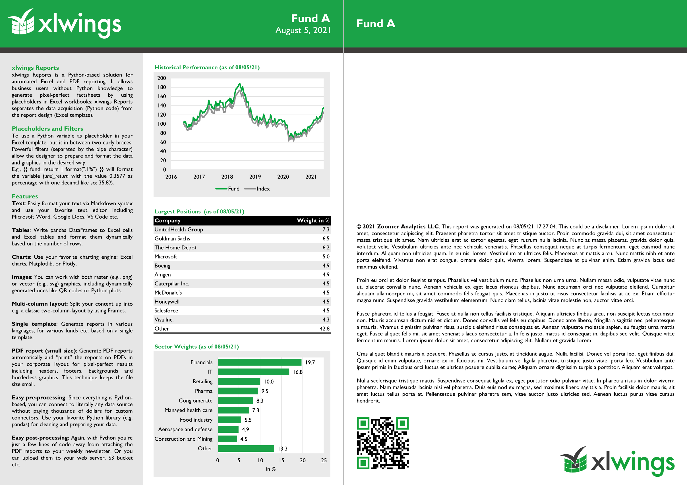

# xlwings Reports: Factsheet Demo



This repo demonstrates how to set up a typical xlwings Reports application. It produces multiple PDF factsheets (as often seen with investment funds) from a single Excel template.

The primary purpose of this demo is to show you how xlwings Reports works conceptually. As such, it doesn't touch on the topic of easy deployment. For this, you may want to check out a freezer like PyInstaller or PyOxidizer or have a look at https://docs.xlwings.org/en/stable/release.html.

It is assumed that you know how to work with Python and xlwings.

## xlwings Reports

For an introduction to xlwings Reports, please start with the official docs: https://docs.xlwings.org/en/stable/reports.html

An xlwings Reports project can be split into three parts:

1. **Pre-processing**: data acquisition and manipulation
2. **Report generation**: fill in the Excel template and turn it into a PDF report
3. **Post-processing**: this takes care of getting the reports to its readers (via email, web page, etc.)

The app that runs these parts can come in various forms:

* **Excel workbook**: this is what this repo uses (`demo.xlsm` is a classic xlwings app using the `RunPython` call)
* **Jupyter notebook**: this may be a good idea if your users are already heavy users
* **Python script or command-line interface (CLI)**: easy to run if your end users are developers or if you want to run it via scheduler
* **GUI**: Use a framework like PySimpleGUI, Gooey, PyQt, Tkinter or wxPython
* **Web-based solution**: use a dashboard framework like Dash or Panel or a full-blown web framework like FastAPI (friendly reminder: while xlwings can run on a server, it needs to have Excel installed and Linux is **not** supported)

## Prerequisites

* xlwings Reports is part of the `xlwings.pro` package and therefore requires a license key. You can get a free trial license key at https://www.xlwings.org/trial.

* Clone or download/unzip this repository

* Install the dependencies (using a virtual or Conda environment is recommended):

  ```
  pip install -r requirements.txt
  ```

* You will also need to have the xlwings add-in installed:

  ```
  xlwings addin install
  ```

  Make sure to point the add-in to the correct environment. Note that for deployment, you don't necessarily need to install the add-in and have the user touch the configuration, but again, that's not the topic of this repo.

## How to run the app

The app produces three Excel and PDF reports: `Fund A.xlsx`, `Fund B.xlsx` and `Fund C.xlxs` under `reports/xlsx` and `Fund A.pdf`, `Fund B.pdf` and `Fund C.pdf` under `reports/pdf`. Since they have been committed to this repo, you can have a look at them without having to run the app.

To produce these reports by yourself, open the `demo.xlsm` file and click the `Run` button. You may want to delete the `reports` directory first.

## Pre-processing

The code in `demo.py` shows how you can easily work with external files:

* **Text**: You can work with Markdown/text files like `data/common/disclaimer.md`. The text uses two times the `asofdate` placeholder with two variations of the `datetime` filter.
* **Word**: The `python-docx` package is used to read `data/common/intro.docx`. The advantage of using something like Word for writing text is that you get automatic spelling/grammar correction. Since xlwings Reports expects your text to be in Markdown, however, you'll need to [disable bulleted lists](https://support.microsoft.com/en-us/office/turn-on-or-off-automatic-bullets-or-numbering-ac3d9d00-0bb6-4421-92a6-f73e564ce71e). Or, if you use filters, you'll also need to [disable smart quotes](https://support.microsoft.com/en-us/office/smart-quotes-in-word-702fc92e-b723-4e3d-b2cc-71dedaf2f343). 
* **CSV**: pandas is used to load the CSV files as DataFrames.

Other data sources like databases, REST APIs etc. are just as easy to add.

## Excel template

The report is generated by filling in the placeholders in the Excel file under `template/template.xlsx`. The Excel workbook is then printed on `template/layout.pdf`. It saves the output files under `reports/xlsx` and `reports/pdf`, respectively.

**Table:**

An Excel table is used to format the rows of the table as striped rows. However, since the header of Excel tables is relatively hard to format, it is hidden by unchecking the `Header Row` checkbox under the `Table Design` ribbon tab and is written in normal Excel cells instead. The table uses a combination of filters that demonstrate how much power the report designer has in preparing the data in the required way without having to write any Python code:

```
{{ holdings | noheader | sortdesc(4) | aggsmall(0.04, 4, "Other") | mul(100, 4) | columns(0, None, None, None, None, 4) }}
```

This takes the `holdings` DataFrame without the header, sorts it in descending order by column 4 (column indices are zero-based), and aggregates values below 0.04 in column 4 in a row called "Other". It then multiplies the values in column 4 by 100 (so that we can put the `%` in the title) and only shows columns 0 and 4 with 4 empty columns in between.

**Charts:**

The chart data is on a separate sheet (`# chart_data`) and uses Excel tables to make sure the charts expand dynamically based on the size of the data. Since the sheet name starts with a `#`, it will be excluded from the PDF report automatically.

## Post-processing

Once your PDF reports are produced, you usually need to process them further: for example, you can send them out as an attachment with your weekly newsletter, or make them available via your web page, etc.

This demo uploads them to a folder in an S3 bucket. If you want to test this out on your end, you'd have to change the `S3_BUCKET` and `S3_FOLDER` variables at the beginning of `demo.py`. You will also have to set up your AWS credentials as explained on the [boto3 docs](https://boto3.amazonaws.com/v1/documentation/api/latest/guide/quickstart.html#configuration).

## Adding an additional fund

The sample project is set up to generate a report for each folder it finds under `data/funds`. If you add an additional folder there with the respective files, it will create an additional report.
